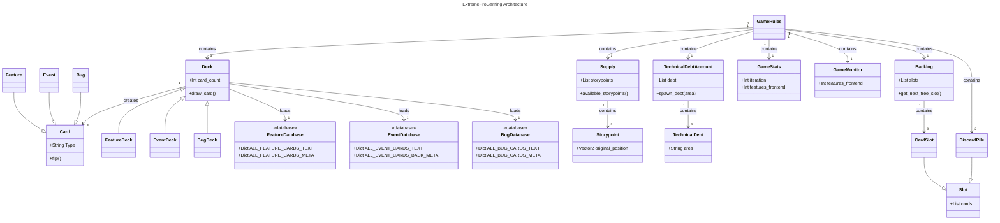

# ExtremeProGaming-Godot

## Helpful Tutorials
- [General Godot Tutorial](https://www.youtube.com/watch?v=LOhfqjmasi0)
- [Godot Tutorial on Card Games](https://www.youtube.com/watch?v=2jMcuKdRh2w&list=PLNWIwxsLZ-LMYzxHlVb7v5Xo5KaUV7Tq1)

## Hosted Game
The Game can be tested [here](https://hpi-swa-lab.github.io/ExtremeProGaming-Godot/).

## Original
Game mechanics and game layout are based on the original [Extreme Pro-Gaming](https://github.com/LucPrestin/Extreme-Pro-gaming) by [Luc Prestin](https://github.com/LucPrestin).

## Architecture

