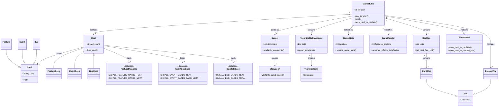

# ExtremeProGaming-Godot
## Table of Contents
1. [Abstract](#abstract)
2. [Original](#original)
3. [Helpful Links and Tutorials](#helpful-links-and-tutorials)
4. [Hosted Game](#hosted-game)
5. [Godot Best Practises](#godot-best-practises)
6. [Graphics](#graphics)
7. [Learnings](#learnings)
8. [Modular Cards](#modular-cards)
9. [Architecture](#architecture)

## Abstract
ExtremeProGaming is an educational game developed by [Luc Prestin](https://github.com/LucPrestin) that simulates an agile software development project. Players manage story points, technical debt, bugs, and features over nine iterations to achieve victory.

The primary goal of this project was to **digitalize** the game to enhance its **scalability** and **adaptability**. Scalability is improved by enabling an unlimited number of students to play simultaneously, while new features and game mechanics can be easily added and tested. Adaptability is achieved through a modular design, allowing content such as cards and card effects to be integrated with minimal effort.

The digital version, built from scratch in GDScript, replicates the rules and components of the original physical game. Over the course duration, the game was developed with added graphics and a modular system was implemented to support the seamless addition of cards of any type.

## Original
Game mechanics and game layout are based on the original [Extreme Pro-Gaming](https://github.com/LucPrestin/Extreme-Pro-gaming) by [Luc Prestin](https://github.com/LucPrestin).

## Helpful Links and Tutorials
- [General Godot Tutorial](https://www.youtube.com/watch?v=LOhfqjmasi0)
- [Godot Tutorial on Card Games](https://www.youtube.com/watch?v=2jMcuKdRh2w&list=PLNWIwxsLZ-LMYzxHlVb7v5Xo5KaUV7Tq1)
- [Host Godot on GitHub](https://www.linkedin.com/pulse/use-github-actions-pages-host-your-godot-engine-game-timothy-cope-exyuc/)
- [Add Translations in Godot](https://www.youtube.com/watch?v=Lw-3Tnwv4Ds)

## Hosted Game
The Game can be tested [here](https://hpi-swa-lab.github.io/ExtremeProGaming-Godot/). The game is automatically deployed with every push using the `index.html` export file in the repository. If you want to publish a new version, make sure to both **push your code changes and include a new export of the game**. Instructions for exporting the game can be found in the second half of [this tutorial](https://www.linkedin.com/pulse/use-github-actions-pages-host-your-godot-engine-game-timothy-cope-exyuc/).

## Godot Best Practises
During my development process, I noticed and researched some techniques for Godot development. Of course, they aren't the holy grail, but they helped me during development.

1. The objects should always be the **child of the object that visually contains it**.
2. References to other classes should always be defined **at the top of the file as a variable**, which is then used throughout the code.
3. There are [naming and formatting conventions](https://docs.godotengine.org/en/stable/tutorials/scripting/gdscript/gdscript_styleguide.html) for GDScript, but the Editor helps you comply with these. The most important ones for me were that files, functions, and variables use **snake_case** and Nodes use **PascalCase**.
4. There are different opinions on folder organization. I used 4 folders:
	- **assets:** contains graphics, sounds, translations, and fonts
	- **scenes:** contains only the scene files
	- **scripts:** contains the corresponding scripts
	- **docs:** contains the export/index files of the game
5. Here is also a general guide to [Best Practices](https://docs.godotengine.org/en/stable/tutorials/best_practices/what_are_godot_classes.html).

## Graphics
The graphics for the game were created using [Figma](https://www.figma.com/de-de/). You can view the design [here](https://www.figma.com/design/3l6M7TX6GotCEMfNElwzsN/ExtremeProgrammingGraphics?node-id=0-1&t=FxfarVfw5MPm9Vvz-1). If you wish to edit the designs, simply duplicate the file into your own Figma account to work on a local copy. To export graphics, select the desired element within Figma and export it as a PNG. The exported PNG files can then be uploaded to the appropriate assets folder in the project.


## Learnings
Here I have collected some important learnings that might be useful for future developers:

1. Godot is **not case sensitive** when it comes to file paths. However, **GitHub is case sensitive**. For example, if you have a file named `storypoint.png`, referencing it as `storypoint.PNG` in Godot will still work. But when hosting the game on GitHub Pages, the asset will not be found if the case does not match exactly. Instructions on how to host the game on GitHub Pages are linked [here](#helpful-links-and-tutorials).

2. The game includes translations for all game text. If you continue maintaining the game, it is recommended to update translations **continuously throughout development** rather than waiting until the end. This approach will save you from a tedious task later on. The translation tutorial I used is linked [here](#helpful-links-and-tutorials).

## Modular Cards
Cards in the game are created at runtime by their corresponding deck. For example, the **Feature Deck** generates its cards by reading data from the `feature_database` file, where all card-related details are defined. Card details are organized into four separate dictionaries, each using the **card name as the key** and the corresponding detail as the value:

- **`ALL_CARDS_GRAPHICS`**: Contains references to the graphical assets needed to assemble the card visuals.

- **`ALL_CARDS_TEXT`**: Stores the translation keys for the card's front text, back text, and effect description.

- **`ALL_CARDS_META`**: Holds metadata about each card, structured as a list in the following order:
  1. Story points  
  2. Area (backend / frontend)  
  3. Boolean – whether the card affects technical debt  
  4. Boolean – whether it is a starting card  
  5. A hint string for the effect description (positive / negative / unknown)  

- **`ALL_CARDS_EFFECTS`**  
  Defines the card's effects when it is selected and flipped. Each effect is represented as a nested list: `[effect_name, parameters]`, where parameters can be a single value or a list of multiple values.

Example Card Definition:

```gdscript
ALL_CARDS_EFFECTS = {"Card0": [["effect_1", [1, "backend"]], ["effect_2", 3]]}
ALL_CARDS_TEXT = {"Card0": ["CARD0_FRONT", "CARD0_BACK", "CARD0_EFFECT"]}
ALL_CARDS_META = {"Card0": [1, "backend", false, false, "unknown"]}
```

To add a new card, simply define a new key in each dictionary (except `ALL_CARDS_GRAPHICS` if no new graphics are needed) and configure the appropriate values. Bug and Feature Cards use all four dictionaries (`GRAPHICS`, `TEXT`, `META`, `EFFECTS`), while Event Cards do not need `ALL_CARDS_META`. When a deck initializes its cards, it performs a lookup into the database and configures each card using the provided data. This includes setting the correct graphics and applying the metadata and effects.


## Architecture
The current game has the following architecture:

```mermaid
classDiagram
	class Card{
	+String Type
	+flip()
	}
	class Feature
	class Event  
	class Bug
	Feature --|> Card
	Event --|> Card
	Bug --|> Card
	class Deck{
	+Int card_count
	+draw_card()
	}
	class FeatureDeck
	class EventDeck
	class BugDeck
	Deck <|-- FeatureDeck
	Deck <|-- EventDeck
	Deck <|-- BugDeck
	Deck "1" --> "n" Card : creates
	Deck --> "1" FeatureDatabase : loads
	Deck --> "1" EventDatabase : loads
	Deck --> "1" BugDatabase : loads
	class Supply{
	+List storypoints
	+available_storypoints()
	}
	class Storypoint{
	+Vector2 original_position
	}
	Supply "1" --> "n" Storypoint : creates
	class TechnicalDebtAccount{
	+List debt
	+spawn_debt(area)
	}
	class TechnicalDebt{
	+String area
	}
	TechnicalDebtAccount "1" --> "n" TechnicalDebt : creates
	class Slot{
	+List cards
	}
	CardSlot --|> Slot
	DiscardPile --|> Slot
	class GameStats{
	+Int iteration
	+ update_game_stats()
	}
	class GameMonitor{
	+Int features_frontend
	+generate_effects_list(effects)
	}
	class Backlog{
	+List slots
	+get_next_free_slot()
	}
	Backlog "1" --> "9" CardSlot : contains
	class FeatureDatabase {
		<<database>>
		+Dict ALL_FEATURE_CARDS_TEXT
		+Dict ALL_FEATURE_CARDS_META
	}
	class EventDatabase {
		<<database>>
		+Dict ALL_EVENT_CARDS_TEXT
		+Dict ALL_EVENT_CARDS_BACK_META
	}
	class BugDatabase {
		<<database>>
		+Dict ALL_BUG_CARDS_TEXT
		+Dict ALL_BUG_CARDS_META
	}
	class GameRules{
		+Int iteration
		+plan_iteration()
		+input()
		+move_card_to_cardslot()
	}
	class PlayerHand{
		+move_card_to_cardslot()
		+move_card_to_discard_pile()
	}
	GameRules "1" --> "1" PlayerHand : instructs
	GameRules "1" --> "1" GameStats : refreshes
	GameRules "1" --> "1" GameMonitor : refreshes
	GameRules "1" --> "1" Backlog : contains
	GameRules "1" --> "1" Supply : contains
	GameRules "1" --> "3" Deck : contains
	GameRules "1" --> "1" TechnicalDebtAccount : contains
	GameRules "1" --> "2" DiscardPile : contains

```
## Game Architecture Overview

- **Decks (Feature, Bug, Event):** Responsible for instantiating and configuring cards at runtime. Each deck fetches card data from the corresponding database and sets up the cards accordingly.

- **Cards:** Contain the logic for how they affect the game state. Cards may hold storypoints, trigger effects, and belong to a specific type (feature, bug, or event).

- **Backlog:** Manages and generates card slots. It organizes which cards are currently available for the player to choose from.

- **Slots (DiscardPile, CardSlot):** Serve as containers that can hold zero, one, or multiple cards.  
	- `CardSlot` is used for cards in play.  
	- `DiscardPile` holds cards that have been played or removed.

- **Storypoints:** Represent a unit of progress or cost. They track how long they remain in the game and can be attached to cards.

- **Technical Debt:** Categorized by area (frontend or backend). May carry storypoints and contributes to the game’s complexity. Some cards increase or reduce technical debt.

- **Supply:** Stores and manages all available storypoints in the game. Provides them to other systems as needed.

- **Technical Debt Account:** Tracks and organizes current technical debt. It reflects accumulated debt and its area classification (frontend/backend).

- **Game Rules:** Orchestrates the overall game logic. Determines win/loss conditions, controls when players can take actions, and dispatches in-game events and effects.

- **Player Hand:** Manages all card movements during the game, such as moving cards between decks, backlog, card slots, and the discard pile.

- **Game Stats:** Stores and updates gameplay statistics, including completed features, resolved bugs, and overall player progress.

- **Game Monitor:** Displays the current phase of the game, explains disabled actions, shows which effects are being executed, and helps guide the player's next steps.
